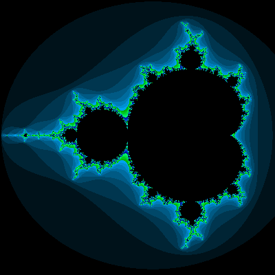

# Fractol

> 🧮 A 42 school project to render fractals in C using the MiniLibX library.

## 📚 Project Overview

Fractol is an interactive fractal viewer written in C. The program uses the MiniLibX graphical library to display different types of fractals, allowing you to zoom, pan, and explore the infinite detail of fractal patterns.

**Implemented fractals:**
- Mandelbrot set
- Julia set
- Burning Ship

## 🎨 Features

✅ Real-time rendering of fractals  
✅ Zoom in/out with mouse scroll  
✅ Move around with arrow keys  
✅ Dynamic color variations  

## 🚀 Getting Started

```bash
git clone https://github.com/jocologne/Fract-ol.git
cd Fract-ol
make
./fractol mandelbrot
./fractol julia <r> <i>
./fractol burningship
```
## 🖼️ Screenshots

<table align="center">
  <tr>
    <td align="center" style="padding:10px">
      <br/>
      <sub>Burning Ship</sub>
    </td>
    <td align="center" style="padding:10px">
      <br/>
      <sub>Mandelbrot</sub>
    </td>
    <td align="center" style="padding:10px">
      <br/>
      <sub>Julia (0.285, 0.01)</sub>
    </td>
  </tr>
</table>


